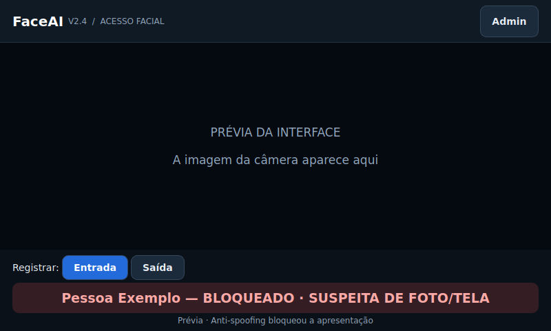
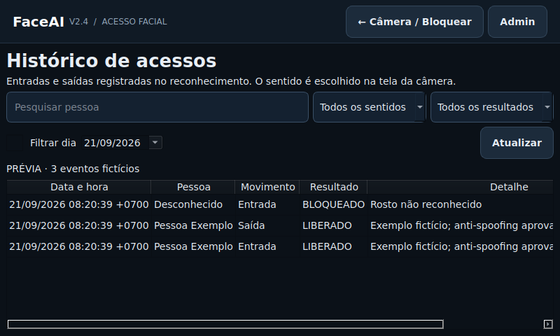

# FaceAI V2.4 — terminal de reconhecimento facial

Aplicação Python com interface PySide6 para computador ou caixa com Orange Pi,
display e câmera. YuNet detecta o rosto; SFace compara com os perfis locais.



## Anti-spoofing passivo da V2.4

A aplicação inclui os pesos pré-treinados **MiniFASNetV2 + MiniFASNetV1SE**, do
[Silent-Face-Anti-Spoofing da Minivision](https://github.com/minivision-ai/Silent-Face-Anti-Spoofing/tree/b6d5f04ad78778917853b25c778acef6d5626d15),
convertidos para ONNX. Licença e atribuição estão em `third_party/`. Os dois modelos
somam cerca de 3,4 MB. Não é necessário instalar PyTorch, baixar modelos no primeiro
uso nem enviar imagens para um servidor. A inferência usa OpenCV DNN na CPU.

Para liberar, o sistema exige simultaneamente:

- Identidade reconhecida e autorizada pelo administrador.
- Cinco amostras com a variação visual exigida na V2.3.
- **Cinco análises consecutivas aprovadas pelos dois modelos anti-spoofing**.

O limiar inicial é **0,80 em cada modelo**, ajustável no admin entre 0,80 e 0,99.
Aumentar o limiar torna a aprovação mais exigente. O score é uma saída do modelo,
não uma probabilidade calibrada de segurança. O padrão ainda precisa de avaliação
com a câmera, iluminação, distância e público do laboratório.

As mensagens distinguem `VERIFICANDO PRESENÇA`, `SUSPEITA DE FOTO/TELA`,
`VERIFICAÇÃO INCONCLUSIVA` e `ERRO NA VERIFICAÇÃO`. Todos os casos sem aprovação
bloqueiam o acesso, inclusive sem relé. Modelo ausente/corrompido, falha de inferência,
evidência antiga e troca de pessoa invalidam a aprovação. Não há fallback que
libere acesso se o modelo falhar nem opção para desativá-lo no painel.

A análise roda para o único rosto selecionado, nas novas inferências de identidade,
e apenas quando o nome é autorizado. Os modelos são carregados uma vez por sessão
de câmera. O aplicativo limita OpenCV a duas threads na inicialização. Isso evita
adicionar PyTorch à placa, mas **não garante FPS específico no Orange Pi**.

São usados recortes com contexto nas escalas 2,7 e 4, redimensionados para 80×80,
BGR float32 em 0..255, conforme o código original. O rosto deve aparecer inteiro e
ter pelo menos 80×80 pixels; se estiver pequeno, cortado ou próximo demais, o app
pede ajuste e bloqueia. O detector YuNet continua sendo o detector do projeto.

### Validação e limites

- Conversão verificada contra PyTorch em três entradas sintéticas por modelo;
  maior diferença absoluta nos logits abaixo de 0,000013. Consulte o manifesto.
- Execução real dos ONNX via CPU testada, além dos testes das regras de decisão.
- Os três exemplos oficiais `image_T1`, `image_F1` e `image_F2` produziram,
  respectivamente, aprovação, suspeita e suspeita, usando YuNet para o recorte.
  Os resultados estão em `docs/antispoof-sample-check.json`; as fotos não são
  distribuídas no pacote. **Três exemplos não são uma avaliação de precisão.**
- Ainda não houve teste físico nesta montagem do Orange Pi. O resultado varia
  conforme câmera, luz, tela usada no ataque e características da apresentação.
  Não existe garantia de bloquear toda foto, vídeo, máscara ou outro ataque.

Antes de habilitar uma fechadura, teste localmente: pessoa real de frente;
foto impressa; foto estática no celular; foto no celular sendo movimentada para
passar na regra de variação; vídeo reproduzido na tela; pouca luz; rosto distante;
câmera desconectada e modelo ausente. Os ataques e situações inconclusivas devem
ficar bloqueados, e os registros devem mostrar o motivo. Se ataques passarem, não
use o reconhecimento como único fator: a calibração ou a solução precisa mudar.

### Atualização

Extraia a V2.4 inteira, incluindo `modelos/antispoof/` e `manifest.json`. Copie de
forma privada o `config.json` e a pasta `dados_privados/` da sua instalação anterior,
preservando senha, perfis e logs. A nova chave `limiar_antispoof` recebe 0,80 quando
não existe. Os parâmetros de câmera, identidade, autorizações e relé são preservados.
Execute `python main.py --kiosk` no venv já usado. A conversão dos modelos já está
feita; `tools/export_antispoof.py` é uma ferramenta de desenvolvimento, não instalação.

## Verificação de cinco imagens na V2.3

A liberação agora exige **cinco amostras recentes do mesmo rosto**, com variação
visual suficiente entre pelo menos duas. Cinco amostras iguais bloqueiam o acesso,
com ou sem relé. O resultado é registrado como `BLOQUEADO`, com o motivo no log.
Não é solicitado um desafio de virar a cabeça.

As amostras são obtidas nas inferências de reconhecimento, não nas repetições da
prévia. Com o intervalo padrão de 0,35 s, cinco amostras levam pelo menos cerca de
1,4 s após a primeira, além do custo do processamento. A separação mínima é 0,15 s.
Uma pausa superior a 2,5 s reinicia a janela. A região central do rosto é reduzida
para 64×64, convertida para cinza e suavizada. Fundo, pequenas diferenças de ruído
e uma mudança uniforme de brilho não bastam para aprovar.

A comparação exige simultaneamente diferença absoluta média ≥ 4 níveis de cinza
e pelo menos 8% dos pixels com diferença ≥ 10, após remover o brilho médio de cada
amostra. São tolerâncias iniciais, **não calibradas na câmera física do Orange Pi**.
São mantidas somente cinco imagens reduzidas em memória; nada é salvo em disco.
O resultado da comparação é reutilizado até chegar uma nova amostra, reduzindo
trabalho nos frames que apenas atualizam a prévia.

A janela é deslizante: uma mudança antiga deixa de valer após cinco novas amostras
iguais. Perda do rosto, troca de identidade, erro ou amostra inválida descartam a
janela. Alterar Entrada/Saída exige cinco novas amostras. A ausência de evidência
válida nunca é tratada como aprovação. Uma imagem real muito imóvel também pode
ser bloqueada; o aviso não significa que uma foto foi identificada.

**Esta regra não é uma prova de vivacidade nem proteção confiável contra fotos.**
Uma foto movimentada, alterações de perspectiva e vídeos podem satisfazer a regra.
Ela implementa a verificação de repetição solicitada, sem alegar identificar uma
pessoa ao vivo. Uma autorização já registrada ou um pulso de relé já emitido não é
desfeito se a imagem ficar estática depois; novos acessos continuam sujeitos à regra.

## Correções e logs preservados da V2.2

- O contador de confirmações acompanha as inferências do reconhecimento. Uma imagem
  de prévia mais nova não apaga as confirmações ainda não consumidas pela interface.
- O cadastro tem a opção visível **Autorizar acesso ao concluir**, marcada para novas
  pessoas. Recadastro preserva a opção de autorização existente.
- Em **Admin → Pessoas cadastradas**, cada perfil mostra sua permissão e um botão
  **Autorizar / Bloquear**. Perfis antigos sem permissão não são autorizados em massa.
- A mensagem `LIBERADO` permanece para o rosto atual. Há um evento por presença e
  sentido; ficar parado não gera várias entradas no histórico.
- A tela da câmera tem **Entrada / Saída**. Selecione o sentido antes de reconhecer;
  mudar o sentido exige novas confirmações, sem reutilizar as anteriores.
- **Admin → Logs de entrada e saída** mostra data/hora com fuso, pessoa, movimento,
  resultado e detalhe. Pode filtrar por nome, dia, sentido e resultado.

O histórico registra uma autorização facial com o sentido selecionado. A câmera
não identifica o sentido físico da passagem e não confirma que a pessoa atravessou
uma porta. A seleção permanece ativa para a próxima pessoa até ser alterada.
Eventos bloqueados/erros não devem ser contados como entradas ou saídas concluídas.



## Recursos preservados

- **Relé opcional:** por padrão, o programa reconhece, confirma e mostra `LIBERADO`
  sem GPIO, com registro no log. O relé pode ser habilitado no painel administrativo.
- **Admin com senha:** cadastro, recadastro, exclusão, configurações e autorizações
  exigem uma sessão autenticada.
- **Sem virar a cabeça:** reconhecimentos consecutivos e a regra de variação acima
  substituem o desafio. Somente inferências novas contam.
- **Rosto destacado:** a marca de enquadramento acompanha o rosto selecionado.
- Interface centrada na câmera, com mensagens grandes, tela cheia e proporção preservada.

**Limite do reconhecimento:** a V2.4 usa anti-spoofing passivo, sujeito a falsos
positivos e falsos negativos. A senha protege a administração; a avaliação física
do anti-spoofing na montagem continua necessária.

## Instalar no computador Ubuntu

```bash
python3 -m venv .venv
source .venv/bin/activate
pip install -U pip
pip install -r requirements.txt
python main.py --windowed
```

## Instalar no Orange Pi 3 LTS

O caminho de instalação permanece o da versão anterior. OpenCV do sistema precisa
oferecer `FaceDetectorYN` e `FaceRecognizerSF` compatíveis com os modelos incluídos.

```bash
sudo apt update
sudo apt install python3-opencv python3-venv libgl1 gpiod
python3 -m venv --system-site-packages .venv
source .venv/bin/activate
pip install -U pip
pip install -r requirements-orange-pi.txt
python main.py --kiosk
```

Sem argumentos, o perfil `orange_pi` abre em tela cheia; os outros abrem em janela.
**F11** alterna tela cheia e **Esc** sai dela. O modo tela cheia não bloqueia o sistema
operacional. O layout foi verificado em 800×480 e 1024×768, em orientação horizontal;
mínimo de 640×400. Para autostart, execute o Python do venv desta pasta com
`main.py --kiosk` no script que já inicia sua aplicação na sessão gráfica.

## Primeiro acesso administrativo

Abra **Admin** e defina uma senha de pelo menos oito caracteres, repetindo-a para
confirmar. Não existe senha padrão. Faça essa configuração pessoalmente **antes de
entregar a caixa para uso público**: quem realiza o primeiro acesso define a senha.
Se cancelar, cadastro e configurações continuam bloqueados.

O painel contém cadastro, pessoas cadastradas, configurações/autorizações, troca
de senha e reinício da câmera. A sessão é bloqueada ao voltar à câmera ou após dois
minutos sem interação. Uma operação pendente não pode salvar após a expiração.
A troca de senha exige também a senha atual.

A senha é armazenada como PBKDF2-HMAC-SHA256, com salt aleatório e 600 mil iterações,
em `dados_privados/admin.json`, com permissão de arquivo `0600` em Linux. Cinco
senhas incorretas causam bloqueio de 30 segundos, mantido ao reabrir o aplicativo.
O arquivo não deve ser versionado nem publicado. Arquivo corrompido bloqueia o login
em vez de permitir criar outra senha. Não há recuperação de senha pela tela pública;
guarde sua senha e um backup privado. Quem controla a conta do sistema e os arquivos
locais pode alterar ou remover a proteção, por isso mantenha o acesso ao sistema restrito.
O cadastro e a digitação da senha precisam de teclado físico ou teclado virtual do sistema.

## Cadastrar e liberar uma pessoa

1. Entre em **Admin → Cadastrar pessoa** e capture o rosto. Mantenha marcada
   **Autorizar acesso ao concluir o cadastro** para permitir o acesso.
2. Para alguém que já foi cadastrado na V2.1, abra **Admin → Pessoas cadastradas**
   e clique em **Autorizar**. Não é necessário recadastrar o rosto.
3. Volte à câmera, selecione **Entrada** ou **Saída** e aguarde a confirmação.

Sem permissão, a tela informa `SEM AUTORIZAÇÃO`; desconhecidos continuam bloqueados.
O padrão de instalação começa sem nomes autorizados. O cadastro guarda apenas o
vetor em `dados_privados/perfis.npz`; fotografias não são salvas.

## Operar sem relé ou com relé

**Sem relé (padrão):** deixe desmarcado **Acionar relé ao liberar acesso**.
Após reconhecer um nome autorizado, completar as confirmações e aprovar
as verificações de anti-spoofing e variação, a interface mostra `LIBERADO` e grava o evento. Isso é autorização no programa,
sem acionamento físico e sem tentativa de importar ou abrir o GPIO.

**Com relé:** marque a opção e configure chip, linha, polaridade e duração do pulso.
O programa aguarda o retorno do GPIO antes de mostrar `LIBERADO`; falha no relé
continua aparecendo como erro e não vira sucesso silenciosamente. O retorno confirma
o pulso de software; não há sensor que confirme a posição física da porta.

Para identificar as linhas na sua montagem:

```bash
gpiodetect
gpioinfo
```

A linha padrão é `-1`: nenhum pino é escolhido automaticamente. O ESP32 não é usado.
Escolha câmera, chip e linha efetivamente validados na sua montagem.

## Atualizar a partir da V2 ou V2.1

Copie, de forma privada, seu `config.json` e `dados_privados/perfis.npz` para a pasta
desta versão. Preserve os originais. Se já usou a V2.1 ou posterior, preserve também
`dados_privados/admin.json` e o log. Não execute duas versões com a mesma câmera.

Câmera, limiares, autorizados e parâmetros de GPIO são preservados. A nova opção
`rele_ativo` começa em `false` quando ausente: **mesmo com GPIO já configurado, é
necessário habilitar explicitamente o relé no painel**. Chaves antigas `vivacidade_*`
são ignoradas e removidas ao salvar; não restauram o desafio de cabeça.

## Logs e dados privados

`dados_privados/acessos.csv` registra horário com fuso, pessoa, decisão, detalhe e
movimento. A atualização migra o CSV anterior de forma atômica, preservando seus
registros; o sentido de eventos antigos aparece como **Não informado**. Não há
exclusão de histórico pelo painel. A tela mostra até 500 resultados por filtro,
com os mais recentes primeiro; o CSV mantém os registros anteriores.
O detalhe distingue autorização sem relé de pulso GPIO concluído; erros e bloqueios
também são registrados. Há intervalo configurável entre liberações.

`config.json`, senhas, perfis e logs são locais e ignorados pelo Git. O pacote desta
entrega não inclui esses arquivos nem o histórico Git. Isso não remove os dados
que já existiam no histórico remoto da versão antiga.

## Testes e validação

```bash
pip install pytest
QT_QPA_PLATFORM=offscreen python -m pytest -q
```

Os testes usam vetores, padrões geométricos e identidades fictícios, sem fotos reais.
Incluem cinco imagens idênticas, um par diferente entre cinco, apenas quatro amostras,
ruído leve, brilho uniforme, mudança apenas no fundo, expiração da janela, perda do
rosto, ausência de evidência e bloqueio em ambos os modos (com e sem relé). Cobrem comparação,
seleção de alvo, perda de rosto, descarte de quadro atrasado, liberação sem GPIO,
erro no modo com relé, fluxo cadastro→entrada→saída com quadros descartados,
migração de logs antigos, filtros, senha, bloqueio por tentativas, cancelamento do login,
expiração da sessão e bloqueio de alterações administrativas.

**76 testes passaram.** A validação automatizada desta entrega usa Linux x86_64, Python 3.12, PySide6 6.11.2,
OpenCV 4.14.0 e NumPy 2.5.3. Não mede FPS nem valida o hardware físico do Orange Pi.
Na caixa, verifique câmera, iluminação, pessoas autorizadas/desconhecidas, troca de
rosto, desconexão da câmera, timeout do admin e, se habilitado, o pulso real do relé.
